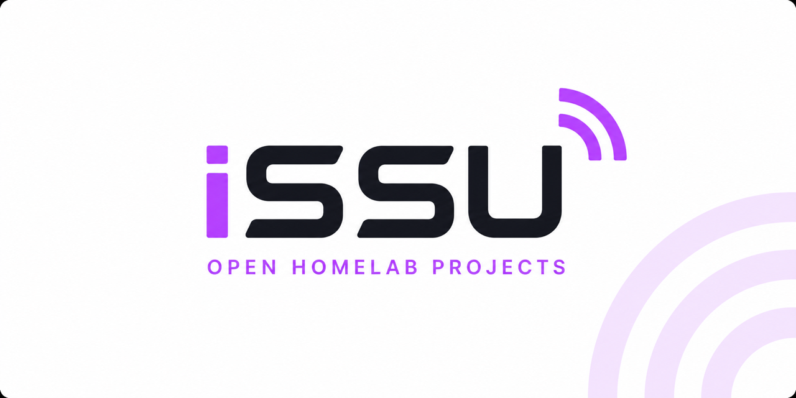

 

**Built for my homelab. Shared with the community.**

Practical projects for home automation, networking and self-hosted infrastructure.

[Explore the Open Homelab ecosystem](https://github.com/issu-lab/Open-Homelab)

---

## About

iSSU is my personal homelab laboratory.

I build tools and infrastructure to solve real needs in my own environment. Projects may be shared at any stage of development, but their maturity and limitations are always stated clearly.

The focus is on practical use, simple architecture, clear documentation and continuous improvement.

---

## Featured Projects

### [ThermoMatrix Card](https://github.com/issu-lab/thermomatrix-card)

A modular LCD-inspired climate card for Home Assistant, with visual configuration, responsive controls and support for different languages and themes.

**Home Automation · Active Development**

### [Load Manager](https://github.com/issu-lab/ha-load-manager)

An AppDaemon application that monitors electrical consumption and manages configured loads through Home Assistant.

**Home Automation · Energy Management · Active Development**

### [Matrix Home](https://github.com/issu-lab/matrix-home)

A self-hosted dashboard for organizing and accessing personal services and homelab applications.

**Infrastructure · Docker · Active Development**

### [IR Thermostat](https://github.com/issu-lab/termostato-ir)

An AppDaemon climate controller that uses power consumption as real-world feedback for stateless infrared devices.

**Home Automation · AppDaemon · Active Development**

---

## In Development

### MikroTik Network Framework

A modular and documented RouterOS framework focused on structured firewall rules, VLAN segmentation, routing policies and reusable configuration modules.

**Networking · Active Development · Coming later**

---

## Areas

- **Home Automation** — Home Assistant, AppDaemon and ESPHome
- **Networking** — MikroTik, VLANs, routing and firewall architecture
- **Infrastructure** — Proxmox, Docker and self-hosted services
- **Automation** — Python, MQTT and reusable workflows

---

## How I Work

- Solve a real problem.
- Build for actual use.
- Keep the structure simple and reusable.
- Test changes in a real homelab.
- Treat documentation as part of the project.
- State maturity and limitations clearly.
- Improve projects gradually.

---

**Build for yourself. Share what works.**

[Open Homelab](https://github.com/issu-lab/Open-Homelab)

